## Pro Tip

The person who comes to the meeting with the most hard data/work done wins. Most people (your instructor included) are so discombobulated/busy that they will show up with more opinions than facts. If you show up with solid, carefully considered evidence you are way ahead. You will go to a ton of meetings in your career. The way to not be disappointed is to be the most prepared person in the room.


---

## Papers of the day

[The PageRank Citation Ranking: Bringing order to the web](http://ilpubs.stanford.edu:8090/422/1/1999-66.pdf)

Abstract:

_The importance of a Web page is an inherently sub jective matter, which depends on the
readers interests, knowledge and attitudes. But there is still much that can be said ob jectively about the relative importance of Web pages. This paper describes PageRank, a method for rating Web pages ob jectively and mechanically, effectively measuring the human interest and attention devoted to them. We compare PageRank to an idealized random Web surfer. We show how to effciently compute PageRank for large numbers of pages. And, we show how to apply PageRank to search and to user navigation._

---

## Not a multibillion dollar company but


---

## Matrix data 


```r
set.seed(12345); par(mar=rep(0.2,4))
dataMatrix <- matrix(rnorm(400),nrow=40)
image(1:10,1:40,t(dataMatrix)[,nrow(dataMatrix):1])
```

<div class="rimage center"></div>


---

## Cluster the data 


```r
par(mar=rep(0.2,4))
heatmap(dataMatrix)
```

<div class="rimage center">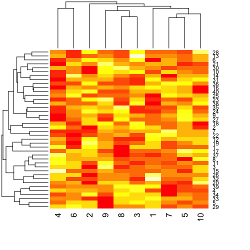</div>


---

## What if we add a pattern?


```r
set.seed(678910)
for(i in 1:40){
  # flip a coin
  coinFlip <- rbinom(1,size=1,prob=0.5)
  # if coin is heads add a common pattern to that row
  if(coinFlip){
    dataMatrix[i,] <- dataMatrix[i,] + rep(c(0,3),each=5)
  }
}
```


---

## What if we add a pattern? - the data


```r
par(mar=rep(0.2,4))
image(1:10,1:40,t(dataMatrix)[,nrow(dataMatrix):1])
```

<div class="rimage center">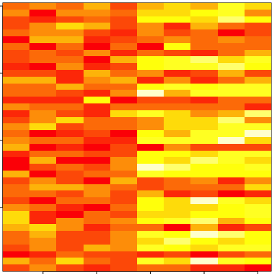</div>


---

## What if we add a pattern? - the clustered data


```r
par(mar=rep(0.2,4))
heatmap(dataMatrix)
```

<div class="rimage center">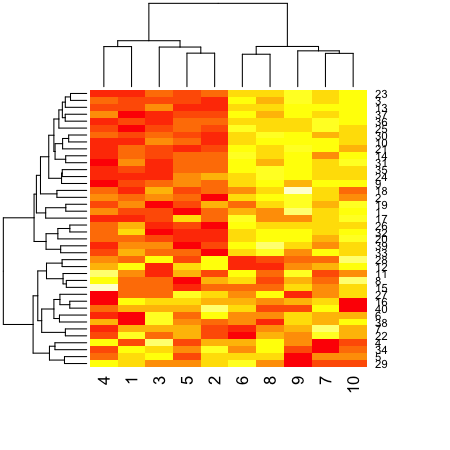</div>


---

## Patterns in rows and columns


```r
hh <- hclust(dist(dataMatrix)); dataMatrixOrdered <- dataMatrix[hh$order,]
par(mfrow=c(1,3))
image(t(dataMatrixOrdered)[,nrow(dataMatrixOrdered):1])
plot(rowMeans(dataMatrixOrdered),40:1,,xlab="Row Mean",ylab="Row",pch=19)
plot(colMeans(dataMatrixOrdered),xlab="Column",ylab="Column Mean",pch=19)
```

<div class="rimage center">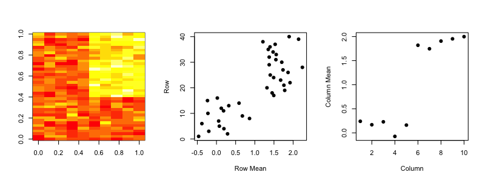</div>


---

## Related problems

You have multivariate variables $X_1,\ldots,X_n$ so $X_1 = (X_{11},\ldots,X_{1m})$

* Find a new set of multivariate variables that are uncorrelated and explain as much variance as possible.
* If you put all the variables together in one matrix, find the best matrix created with fewer variables (lower rank) that explains the original data.


The first goal is <font color="#330066">statistical</font> and the second goal is <font color="#993300">data compression</font>.


--- 

## Same thing, now with more math

Suppose we have $n$ measurements on each of $m$ variables $X_j$, $j=1,\ldots,n$. There are (at least) two equivalent ways to set up the problem

* Produce a derived (and small) set of uncorrelated variables $Z_k = \alpha_k X$, $k=1,2,\ldots,q < m$ that are linear combinations of the original variables, and that explain most of the variation in the original data
* Approximate the $n \times m$ matrix $X$ by the best rank-$q$ matrix $\hat{X}_{(q)}$. 


---

## Related solutions - PCA/SVD

__SVD__

If $X$ is a matrix with each variable in a column and each observation in a row then the SVD is a "matrix decomposition"

$$ X = UDV^T$$

where the columns of $U$ are orthogonal (left singular vectors), the columns of $V$ are orthogonal (right singular vectors) and $D$ is a diagonal matrix (singular values). 

__PCA__

The principal components are equal to the right singular values if you first scale (subtract the mean, divide by the standard deviation) the variables.


---

## The idea behind PCA

If $X$ is a random vector with mean $0$ and covariance matrix $\Sigma$ then the variance of the linear combination $Z = \alpha^T X$ is given by:

$${\rm Var}(Z) = \alpha^T\Sigma\alpha$$

We are seeking an $\alpha$ such that ${\rm Var}(Z)$ is large; clearly we must impose a scale restriction on $\alpha$. This leads to the principal-component criterion:

$\max_{\alpha} \alpha^T\Sigma\alpha$ subject to $||\alpha|| = 1$

The solution $\alpha$ is the largest eigenvector of $\Sigma$:

$$\Sigma \alpha = d^2 \alpha$$

and ${\rm Var}(Z) = {\rm Var}(\alpha^T X) = d^2$.

---

## PCA derived variables


$Z_1 = \alpha_1^T X$ is the projection of the data onto the longest direction, and has the largest variance amongst all such normalized projections. $\alpha_1$ is the largest eigenvalue of $\hat{\Sigma}$, the sample covariance matrix of $X$. $Z_2$ and $\alpha_2$ correspond to the second-largest eigenvector.


---

## Singular value decomposition 

For any $n \times m$ matrix $X$ (assume $n > m$):
$$X = UDV^T$$
is the SVD of $X$ where
* $U$ is $n \times m$ orthogonal, the left singular vectors
* $V$ is $m \times m$ orthogonal, the right singular vectors
* $D$ is diagonal with $d_1 \geq d_2 \geq \cdots \geq d_m \geq 0$, the singular 

The SVD always exists, and is unique (up to signs and ties). 

---

## SVD is the best rank $q$ approximation 

Let $D_q$ be $D$ but all but the first $q$ diagonal elements set to zero. Then $\hat{X}_q = UD_qV^T$ solves:

$$\min_{{\rm rank}(\hat{X}_q) = q} || X - \hat{X}_q||_F$$

here $||\cdot||_F$ is the Frobenius norm: $||X||_F = \sqrt{\sum_{i,j} x_{ij}^2}$ $= \sqrt{{\rm tr}(X^TX)}$


---

## Some important mathematical facts

$$X = UDV^T = \sum_{j=1}^r \sigma_j u_j v_j^T$$ 

where $r$ is the rank of $X$. Since $\min_{r(Z) = k} ||X-Z||_F$ is

$$Z = \hat{X}_k = \sum_{j=1}^k \sigma_j u_j v_j^T$$

the truncation error is:

$$|| X - \hat{X}_k||^2 = \sum_{j=k+1}^r \sigma^2_j$$


---

## SVD dimensions in pictures


https://dl.dropboxusercontent.com/u/7710864/jhsph753/lectures/vadim.pdf

---

## SVD and residuals

$\hat{X}_k = \sum_{j=1}^k \sigma u_jv_j^T$ and $R = \sum_{k+1}^n \sigma u_j v_j^T$ for $k=\{1,3,9,18,36,72,144\}$


https://dl.dropboxusercontent.com/u/7710864/jhsph753/lectures/vadim.pdf

---

## Data compression from SVD

* Instead of storing $\hat{X}_k$ as $m \times n$ matrix store $k \times m + k \times n + k = k \times (m+n+1)$ values.
* Since often $r(X) = \min(m,n)$
* Typically $k << r(X)$
* Typically $k \times (m + n + 1) << mn$ 
* In this sense matrix reduction is equivalent to data compression

https://dl.dropboxusercontent.com/u/7710864/jhsph753/lectures/vadim.pdf

---

## Important fact

$$ X^TX = VDU^T UDV^T = VD^2V^T$$
$$ XX^T  = UDV^T VDU^T = UD^2U^T$$

$X^TX$ and $XX^T$ are symmetric matrices. 

---

## Spectral theorem

Every symmetric matrix $\Sigma$ can be decomposed

$$ \Sigma = W \Lambda W^T$$ 

* $W$ are orthogonal eigenvectors
* $\Lambda$ are a diagonal matrix of real valued eigenvectors
* $CW = W\Lambda$ so $Cw_j = \lambda_i w_j$ (eigenvector definition)

---

## Relationship to PCA

If $X$ is centered (column means zero). Then 

$$C = \frac{1}{n}\sum_i x_i x_i^T = \frac{1}{n}XX^T$$

is an estimator of covariance. $C$ is symmetric and we are looking for the largest eigenvalue. Recall that

$$C = W\Lambda W = VD^{2}V^T$$

For $X$ is centered (column means zero)
* The columns of $V$ are the principal components, 
* $Z_j = U_j d_j$ are the scores
* $\frac{d_i^2}{\sum_{j=1}^m d_j^2}$ is the ``fraction of variation explained'' by the $i$th singular vector

---

## Linear-Bilinear regression 

Gabriel 1978 JRSSB showed how to do this with covariates. Suppose we want to minimize:

$$\min_{{\rm rank}(\hat{X}_q) = q} || X - \beta Z - \hat{X}_q||_F$$

We can do this in three steps:

* Calculate the least squares estimator $\hat{\beta}$ minimizing  $|| X - \beta Z |_F$
* Calculate the residuals $R = X - \hat{\beta}Z$
* Take the singular value decomposition of $R = UDV^T$. Set all but the first $q$ diagonal elements of $D$ to zero. 


---

## A blessing of dimensionality


---

## A property of imbalanced dimensions


---

## Components of the SVD - $u$ and $v$


```r
svd1 <- svd(scale(dataMatrixOrdered))
par(mfrow=c(1,3))
image(t(dataMatrixOrdered)[,nrow(dataMatrixOrdered):1])
plot(svd1$u[,1],40:1,,xlab="Row",ylab="First left singular vector",pch=19)
plot(svd1$v[,1],xlab="Column",ylab="First right singular vector",pch=19)
```

<div class="rimage center">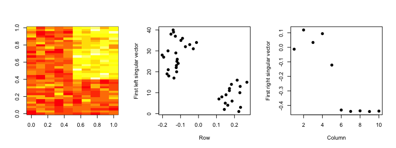</div>


---

## Components of the SVD - Variance explained


```r
par(mfrow=c(1,2))
plot(svd1$d,xlab="Column",ylab="Singular value",pch=19)
plot(svd1$d^2/sum(svd1$d^2),xlab="Column",ylab="Prop. of variance explained",pch=19)
```

<div class="rimage center">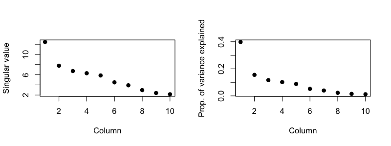</div>


---

## Relationship to principal components


```r
svd1 <- svd(scale(dataMatrixOrdered))
pca1 <- prcomp(dataMatrixOrdered,scale=TRUE)
plot(pca1$rotation[,1],svd1$v[,1],pch=19,xlab="Principal Component 1",ylab="Right Singular Vector 1")
abline(c(0,1))
```

<div class="rimage center"></div>


---

## Components of the SVD - variance explained


```r
constantMatrix <- dataMatrixOrdered*0
for(i in 1:dim(dataMatrixOrdered)[1]){constantMatrix[i,] <- rep(c(0,1),each=5)}
svd1 <- svd(constantMatrix)
par(mfrow=c(1,3))
image(t(constantMatrix)[,nrow(constantMatrix):1])
plot(svd1$d,xlab="Column",ylab="Singular value",pch=19)
plot(svd1$d^2/sum(svd1$d^2),xlab="Column",ylab="Prop. of variance explained",pch=19)
```

<div class="rimage center">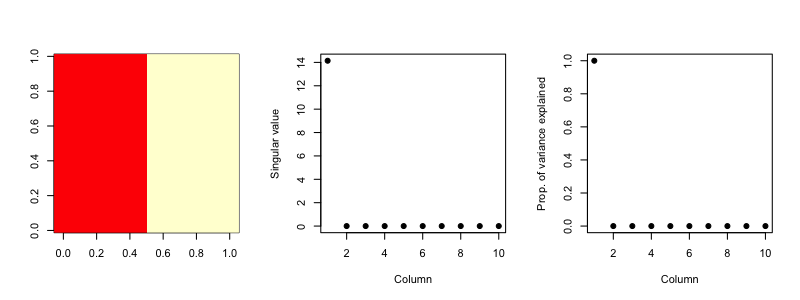</div>


---

## What if we add a second pattern?


```r
set.seed(678910)
for(i in 1:40){
  # flip a coin
  coinFlip1 <- rbinom(1,size=1,prob=0.5)
  coinFlip2 <- rbinom(1,size=1,prob=0.5)
  # if coin is heads add a common pattern to that row
  if(coinFlip1){
    dataMatrix[i,] <- dataMatrix[i,] + rep(c(0,5),each=5)
  }
  if(coinFlip2){
    dataMatrix[i,] <- dataMatrix[i,] + rep(c(0,5),5)
  }
}
hh <- hclust(dist(dataMatrix)); dataMatrixOrdered <- dataMatrix[hh$order,]
```


---

## Singular value decomposition - true patterns 


```r
svd2 <- svd(scale(dataMatrixOrdered))
par(mfrow=c(1,3))
image(t(dataMatrixOrdered)[,nrow(dataMatrixOrdered):1])
plot(rep(c(0,1),each=5),pch=19,xlab="Column",ylab="Pattern 1")
plot(rep(c(0,1),5),pch=19,xlab="Column",ylab="Pattern 2")
```

<div class="rimage center">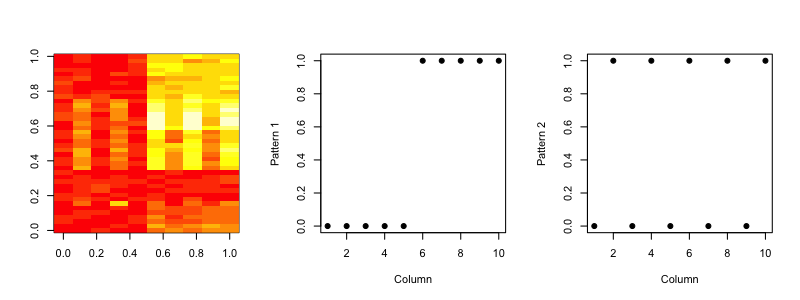</div>


---

##  $v$ and patterns of variance in rows


```r
svd2 <- svd(scale(dataMatrixOrdered))
par(mfrow=c(1,3))
image(t(dataMatrixOrdered)[,nrow(dataMatrixOrdered):1])
plot(svd2$v[,1],pch=19,xlab="Column",ylab="First right singular vector")
plot(svd2$v[,2],pch=19,xlab="Column",ylab="Second right singular vector")
```

<div class="rimage center">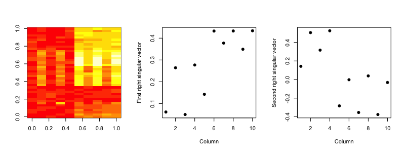</div>


---

##  $d$ and variance explained (scree plot)


```r
svd1 <- svd(scale(dataMatrixOrdered))
par(mfrow=c(1,2))
plot(svd1$d,xlab="Column",ylab="Singular value",pch=19)
plot(svd1$d^2/sum(svd1$d^2),xlab="Column",ylab="Percent of variance explained",pch=19)
```

<div class="rimage center">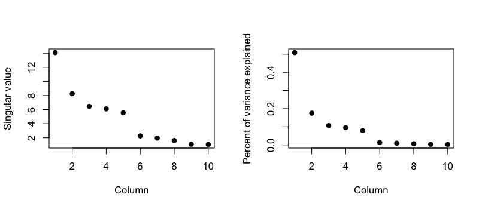</div>


---

## A pathological case


```r
dataMatrix <- matrix(rnorm(400),nrow=40)
dataMatrix[1,] = 50*rep(c(0,1),each=5)
ss = svd(dataMatrix - rowMeans(dataMatrix)); plot(ss$v[,1])
```

<div class="rimage center">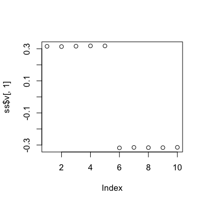</div>


---

## Choosing the number of components

If $m$ is large:


Otherwise:

* Calculate observed statistics $s_i = \frac{d_i^2}{\sum_{j=1}^m d_j^2}$, $i=1,\ldots,m$
* Permute each row or column of the data separately to get null matrices $X^{0b}$, $b=1,\ldots,B$
* Recalculate the SVD and get null statistics $s_i^0 = \frac{d_i^{02}}{\sum_{j=1}^m d_j^{02}}$, $i=1,\ldots,m$
* Calculate $p$-values for each component:
$$ p_i = \frac{1+\sum_{b=1}^B I(s_i^0 > s_i)}{B+1}$$

Buja, A. and Eyuboglu, N. (1992). Remarks on parallel analysis.

---

## Missing values


```r
dataMatrix2 <- dataMatrixOrdered
## Randomly insert some missing data
dataMatrix2[sample(1:100,size=40,replace=FALSE)] <- NA
svd1 <- svd(scale(dataMatrix2))  ## Doesn't work!
```

```
Error: infinite or missing values in 'x'
```


---

## Imputing {impute}


```r
library(impute)  ## Available from http://bioconductor.org
dataMatrix2 <- dataMatrixOrdered
dataMatrix2[sample(1:100,size=40,replace=FALSE)] <- NA
dataMatrix2 <- impute.knn(dataMatrix2)$data
svd1 <- svd(scale(dataMatrixOrdered)); svd2 <- svd(scale(dataMatrix2))
par(mfrow=c(1,2)); plot(svd1$v[,1],pch=19); plot(svd2$v[,1],pch=19)
```

<div class="rimage center">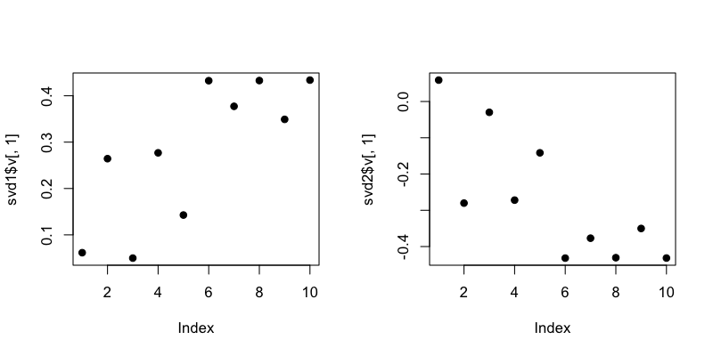</div>


---

## Face example

<!-- ## source("http://dl.dropbox.com/u/7710864/courseraPublic/myplclust.R") -->


```r
load("data/face.rda")
image(t(faceData)[,nrow(faceData):1])
```

<div class="rimage center">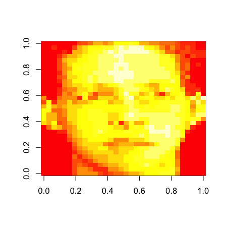</div>


---

## Face example - variance explained


```r
svd1 <- svd(scale(faceData))
plot(svd1$d^2/sum(svd1$d^2),pch=19,xlab="Singular vector",ylab="Variance explained")
```

<div class="rimage center">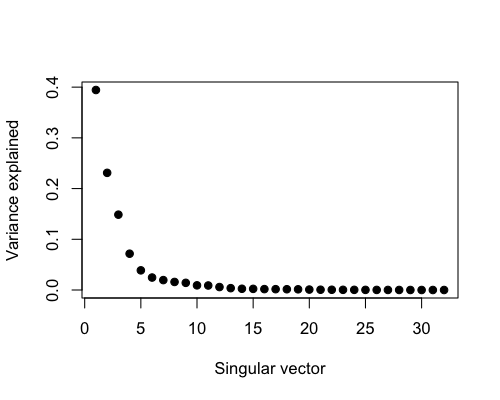</div>


---

## Face example - create approximations


```r

svd1 <- svd(scale(faceData))
## Note that %*% is matrix multiplication

# Here svd1$d[1] is a constant
approx1 <- svd1$u[,1] %*% t(svd1$v[,1]) * svd1$d[1]

# In these examples we need to make the diagonal matrix out of d
approx5 <- svd1$u[,1:5] %*% diag(svd1$d[1:5])%*% t(svd1$v[,1:5]) 
approx10 <- svd1$u[,1:10] %*% diag(svd1$d[1:10])%*% t(svd1$v[,1:10]) 
```


---

## Face example - plot approximations

```r
par(mfrow=c(1,4))
image(t(approx1)[,nrow(approx1):1], main = "(a)")
image(t(approx5)[,nrow(approx5):1], main = "(b)")
image(t(approx10)[,nrow(approx10):1], main = "(c)")
image(t(faceData)[,nrow(faceData):1], main = "(d)")  ## Original data
```

<div class="rimage center">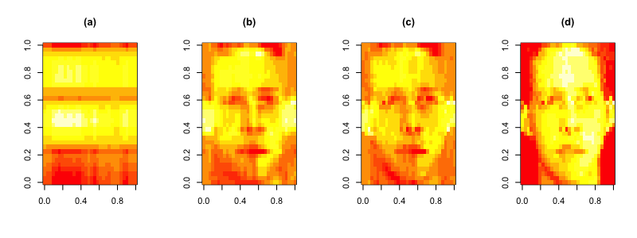</div>


--- 

## Digits example


130 threes, a subset of 638 such threes and part of the handwritten digit dataset used in the Elements of Statistical learning. Each three is a $16\times 16$ greyscale image and the variables $X_j$ $j =1,\ldots 256$ are the grey scale values for each pixel. 

--- 

## Digits example


Two-component model has the form:

$$\hat{f}(\lambda)  = \bar{X} + \lambda_1 v_1 + \lambda_2 v_2$$


---

## Example application: Pagerank


http://statweb.stanford.edu/~tibs/ElemStatLearn/

---

## Random surfer model

* $L_{ij} = 1$ if page $j$ points to page $i$
* $c_j = \sum_{i=1}^N L_{ij}$ equal the number of pages pointed to by page $j$
* Think about a "random surfer" who starts on a page and clicks a link at random
* What ist he probability they end up on any specific page?
* This is a [Markov Chain](http://en.wikipedia.org/wiki/Markov_chain)

$$p_i = (1-d)/N + d \sum_{j=1}^N \left(\frac{L_{ij}}{c_j} p_j\right)$$

http://statweb.stanford.edu/~tibs/ElemStatLearn/

---

## Pagerank as an eigenvalue problem

$$p = (1-d) e + d LD_c^{-1}p$$

where $e$ is a vector of ones and $D_c = diag(c)$ is a diagonal matrix with elements $c_j$. If we assume $e^Tp = N$ (so the average PageRank is 1) then:

$$p = [(1-d)ee^T/N+ dLD_c^{-1}]p$$
$$ = Ap$$

* $A$ has largest eigenvalue equal to 1 (properties of Markov Chain)
* So you can solve for the eigenvector using the [power method](http://en.wikipedia.org/wiki/Power_iteration)
* $p_k \leftarrow A p_{k-1}$ ; $p_k \leftarrow N \frac{p_k}{e^Tp_k}$

http://statweb.stanford.edu/~tibs/ElemStatLearn/


---

## Back to the example


$$L = \left(\begin{array}{cccc} 0 & 0 & 1 & 0 \\ 1 & 0 & 0 & 0 \\ 1 & 1& 0 & 1 \\ 0 & 0 & 0& 0 \end{array}\right)$$

---

## Doing PageRank in R 


```r
L = matrix(c(0,0,1,0,1,0,0,0,1,1,0,1,0,0,0,0),byrow=T,nrow=4)
cc = colSums(L); d = 0.85; e = rep(1,4); N = 4
A = (1-d) * e %*% t(e) + d * L %*% solve(diag(cc))
Re(eigen(A)$values)
```

```
[1]  1.450e+00 -4.250e-01 -4.250e-01  1.761e-17
```

```r
phat = Re(eigen(A)$vectors[1,]); phat = (N* phat/(t(e) %*% phat))
phat
```

```
[1]  1.185e+00  1.408e+00  1.408e+00 -7.284e-16
```


---

## Notes and further resources

* Scale matters
* PC's/SV's may mix real patterns
* Can be computationally intensive
* [Advanced data analysis from an elementary point of view](http://www.stat.cmu.edu/~cshalizi/ADAfaEPoV/ADAfaEPoV.pdf)
* [Elements of statistical learning](http://www-stat.stanford.edu/~tibs/ElemStatLearn/)
* Alternatives
  * [Factor analysis](http://en.wikipedia.org/wiki/Factor_analysis)
  * [Independent components analysis](http://en.wikipedia.org/wiki/Independent_component_analysis)
  * [Latent semantic analysis](http://en.wikipedia.org/wiki/Latent_semantic_analysis)


