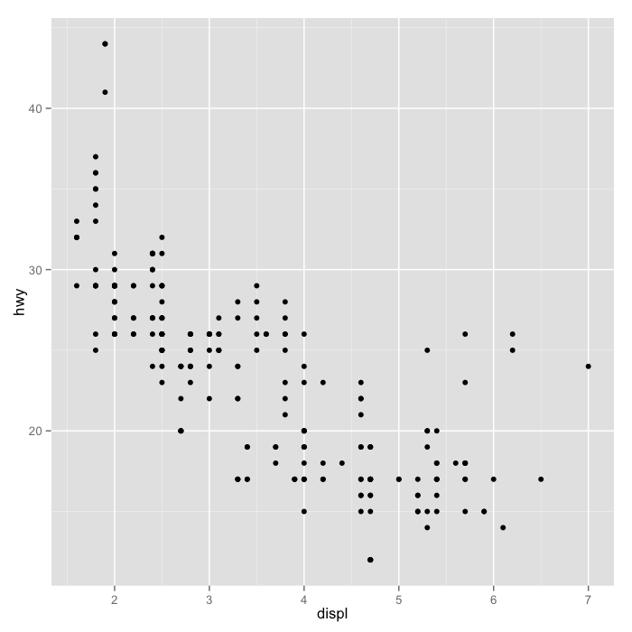
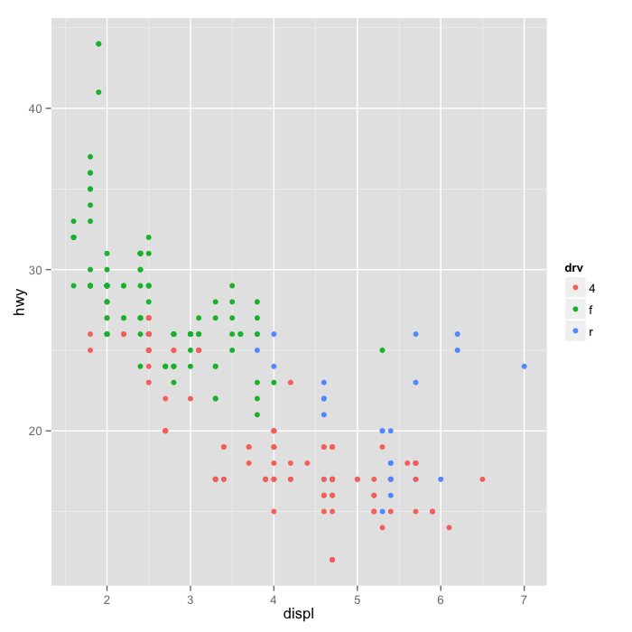
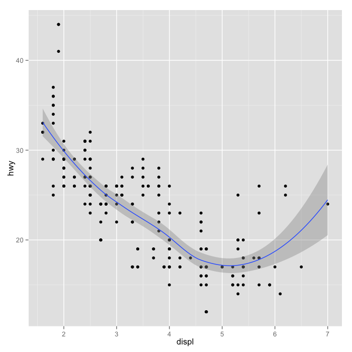
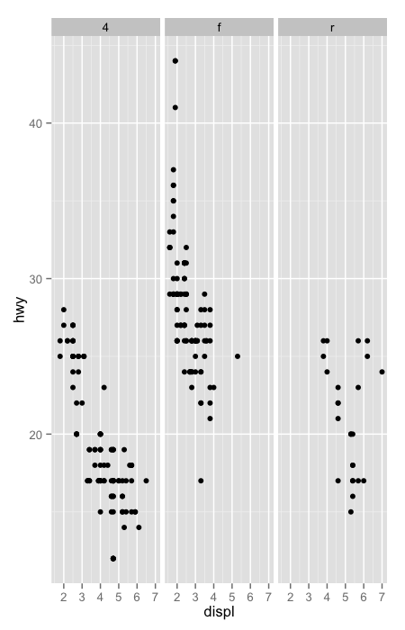
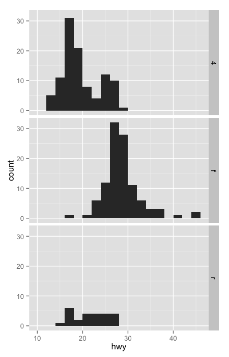

## Pro tip

It is a weird time in academics. There used to be one track to being well-known

<center>Publish good papers -> "Fame"</center>

Now there are a lot of other possible routes

<center>Blogs, Twitter, Github, R packages, Publish good papers -> "Fame"</center>

I like that there is variety. If you want to be taken seriously one __absolutely critical__ thing is to have a portfolio of serious work (good R packages, good papers, blog posts that are basicly science papers).

---

## ~~Papers~~ Blog posts of the day

[The network nonsense of Albert-László Barabási](http://liorpachter.wordpress.com/2014/02/10/the-network-nonsense-of-albert-laszlo-barabasi/)

[The network nonsense of Manolis Kellis](http://liorpachter.wordpress.com/2014/02/11/the-network-nonsense-of-manolis-kellis/)

[Why I read the network nonsense papers](http://liorpachter.wordpress.com/2014/02/12/why-i-read-the-network-nonsense-papers/)

[Methods matter, but incentives matter more](http://nickeriksson.blogspot.com/2014/02/methods-matter-but-incentives-matter.html)

If you read these, you must read the comments as well, including the responses from the authors who were called out. 


---

## A good book


---

## EDA - plotting

* During EDA you will often have the choice of performing a statistical test/summary or making a plot. __Make the plot.__ 
* This doesn't mean don't think! 
* Choosing how to make plots and using them to convince yourself/others that trends are real is an important skill.


---

## Why plot


http://en.wikipedia.org/wiki/Anscombe's_quartet

---

## Characteristics of exploratory graphs

* They are made quickly
* A large number are made
* The goal is for personal understanding
* Axes/legends are generally cleaned up
* Color/size are primarily used for information


---

## EDA

* EDA is part statistics, part psychology
* Ufortunately we (humans) are designed to find patterns even when there aren't any
* Visual perception is biased by your humanness. 
* The key goal in exploratory EDA is to not trick yourself

---

## What optical illusions tell us about EDA


[http://brainden.com/visual-illusions.htm](http://brainden.com/visual-illusions.htm)


---

## What optical illusions tell us about EDA


http://blog.revolutionanalytics.com/2012/12/create-optical-illusions-with-r.html
http://rpubs.com/kohske/R-de-illusion


---

## Plots can be thought of as test statistics


[Graphical inference for infovis](http://vita.had.co.nz/papers/inference-infovis.pdf)


---

## Background - perceptual tasks


[Graphical perception: Theory, Experimentation, and Applications to the Development of Graphical Models](http://www.jstor.org/discover/10.2307/2288400?uid=3739704&uid=2&uid=4&uid=3739256&sid=21101742782357)


---

## Position versus length


[Graphical perception: Theory, Experimentation, and Applications to the Development of Graphical Models](http://www.jstor.org/discover/10.2307/2288400?uid=3739704&uid=2&uid=4&uid=3739256&sid=21101742782357)


---

## Position versus length - results


[Graphical perception: Theory, Experimentation, and Applications to the Development of Graphical Models](http://www.jstor.org/discover/10.2307/2288400?uid=3739704&uid=2&uid=4&uid=3739256&sid=21101742782357)

---

## Position versus angle


[Graphical perception: Theory, Experimentation, and Applications to the Development of Graphical Models](http://www.jstor.org/discover/10.2307/2288400?uid=3739704&uid=2&uid=4&uid=3739256&sid=21101742782357)


---

## Position versus angle - results

<center> This is why statistiicans hate pie charts </center>


<br><br>
[Graphical perception: Theory, Experimentation, and Applications to the Development of Graphical Models](http://www.jstor.org/discover/10.2307/2288400?uid=3739704&uid=2&uid=4&uid=3739256&sid=21101742782357)

http://simplystatistics.org/2012/11/27/i-give-up-i-am-embracing-pie-charts/


---

## In general people are bad at slopes


<br><br>
[Graphical perception: Theory, Experimentation, and Applications to the Development of Graphical Models](http://www.jstor.org/discover/10.2307/2288400?uid=3739704&uid=2&uid=4&uid=3739256&sid=21101742782357)


---

## More experimental results


[Graphical Perception and Graphical Methods for Analyzing Scientific Data](http://www.sciencemag.org/content/229/4716/828.refs)


---

## Scale matters


[Variables on Scatterplots Look More Highly Correlated When the Scales are
Increased](http://statweb.stanford.edu/~cgates/PERSI/papers/scatter82.pdf)


---

## People perceive correlations weirdly


[Variables on Scatterplots Look More Highly Correlated When the Scales are
Increased](http://statweb.stanford.edu/~cgates/PERSI/papers/scatter82.pdf)

---

## Detecting significance


Fisher, Anderson, Leek (in prep.)

---

## People are bad at this


Fisher, Anderson, Leek (in prep.)

See for yourself: http://glimmer.rstudio.com/afisher/EDA/

---

## Summary

* Use common scales when possible
* When possible use position comparisons
* Angle comparisons are frequently hard to interpret (no piecharts!)
* No 3-D barcharts
* Be careful not to "fool" yourself about significance (either way)

---

## The most important plots

* `plot` - scatterplot
  * ask,mar,mfrow,cex,cex.axis(etc.),col,pch,lwd,lty,las
* `qqplot` - Quantile-quantile plot 
  * use `abline(c(0,1))`
* `boxplot` boxplots for distributions
  * varwidth, col
* `hist` for distributions (multiple)
  * varwdith
* `image`, `heatmap` - multivariate data
  * `image(t(dat)[,nrow(dat):1])`
  * x,y,z,zlim,col,breaks
* `stripchart` - like boxplot but with points
  * jitter, metohd, at, add,vertical


---

## What is a Graphics Device?

* A graphics device is something where you can make a plot appear

  * A window on your computer (screen device)
  
  * A PDF file (file device)

  * A PNG or JPEG file (file device)

  * A scalable vector graphics (SVG) file (file device)

* When you make a plot in R, it has to be "sent" to a specific
  graphics device

* The most common place for a plot to be "sent" is the *screen device*

  * On a Mac the screen device is launched with the `quartz()`

  * On Windows the screen device is launched with `windows()`

  * On Unix/Linux the screen device is launched with `x11()`


---

## How Does a Plot Get Created?

The second approach to plotting is most commonly used for file devices:

1. Explicitly launch a graphics device

2. Call a plotting function to make a plot (Note: if you are using a file
device, no plot will appear on the screen)

3. Annotate plot if necessary

3. Explicitly close graphics device with `dev.off()` (this is very important!)


```r
pdf(file = "myplot.pdf")  ## Open PDF device; create 'myplot.pdf' in my working directory
## Create plot and send to a file (no plot appears on screen)
with(faithful, plot(eruptions, waiting))  
title(main = "Old Faithful Geyser data")  ## Annotate plot; still nothing on screen
dev.off()  ## Close the PDF file device
## Now you can view the file 'myplot.pdf' on your computer
```


---

## Graphics File Devices

There are two basic types of file devices: *vector* and *bitmap*
devices

Vector formats:

- `pdf`: useful for line-type graphics, resizes well, usually
  portable, not efficient if a plot has many objects/points

- `svg`: XML-based scalable vector graphics; supports animation and
  interactivity, potentially useful for web-based plots

- `win.metafile`: Windows metafile format (only on Windows)

- `postscript`: older format, also resizes well, usually portable, can
  be used to create encapsulated postscript files; Windows systems
  often don’t have a postscript viewer


---

## Graphics File Devices

Bitmap formats

- `png`: bitmapped format, good for line drawings or images with solid
  colors, uses lossless compression (like the old GIF format), most
  web browsers can read this format natively, good for plotting many
  many many points, does not resize well

- `jpeg`: good for photographs or natural scenes, uses lossy
  compression, good for plotting many many many points, does not
  resize well, can be read by almost any computer and any web browser,
  not great for line drawings

- `tiff`: Creates bitmap files in the TIFF format; supports lossless
  compression

- `bmp`: a native Windows bitmapped format

---

## Copying Plots

Copying a plot to another device can be useful because some plots
require a lot of code and it can be a pain to type all that in again
for a different device.

- `dev.copy`: copy a plot from one device to another

- `dev.copy2pdf`: specifically copy a plot to a PDF file 

NOTE: Copying a plot is not an exact operation, so the result may not
be identical to the original.


```r
library(datasets)
with(faithful, plot(eruptions, waiting))  ## Create plot on screen device
title(main = "Old Faithful Geyser data")  ## Add a main title
dev.copy(png, file = "geyserplot.png")  ## Copy my plot to a PNG file
dev.off()  ## Don't forget to close the PNG device!
```


---

## Summary

* Plots must be created on a graphics device

* The default graphics device is almost always the screen device,
  which is most useful for exploratory analysis

* File devices are useful for creating plots that can be included in
  other documents or sent to other people

* For file devices, there are vector and bitmap formats

  - Vector formats are good for line drawings and plots with solid
    colors using a modest number of points

  - Bitmap formats are good for plots with a large number of points,
    natural scenes or web-based plots

---

## Plotting and Color
- The default color schemes for most plots in R are horrendous
  - I don’t have good taste and even I know that
- Recently there have been developments to improve the handling/specifica1on of colors in plots/graphs/etc.
- There are functions in R and in external packages that are very handy

---

## Colors 1, 2, and 3


---

## Default Image Plots in R


---

## Color U1li1es in R

- The `grDevices` package has two functions 
  - `colorRamp`
  - `colorRampPalette`
- These functions take palettes of colors and help to interpolate between the colors
- The function colors() lists the names of colors you can use in any plotting function

---

## Color Palette Utilities in R

- `colorRamp`: Take a palette of colors and return a function that takes valeus between 0 and 1, indicating the extremes of the color palette (e.g. see the 'gray' function)
- `colorRampPalette`: Take a palette of colors and return a function that takes integer arguments and returns a vector of colors interpolating the palette (like `heat.colors` or `topo.colors`)

---

## colorRamp

`[,1] [,2] [,3]` corresponds to `[Red] [Blue] [Green]`

```r
> pal <- colorRamp(c("red", "blue"))

> pal(0)
     [,1] [,2] [,3]
[1,]  255    0    0

> pal(1)
     [,1] [,2] [,3]
[1,]    0    0  255

> pal(0.5)
      [,1] [,2]  [,3]
[1,] 127.5    0 127.5
```

---

## colorRamp

```r
> pal(seq(0, 1, len = 10))
                  [,1] [,2]       [,3]
        [1,] 255.00000    0          0
        [2,] 226.66667    0   28.33333
        [3,] 198.33333    0   56.66667
        [4,] 170.00000    0   85.00000
        [5,] 141.66667    0  113.33333
        [6,] 113.33333    0  141.66667
        [7,]  85.00000    0  170.00000
        [8,]  56.66667    0  198.33333
        [9,]  28.33333    0  226.66667
        [10,]  0.00000    0  255.00000
```

---

## colorRampPalette

```r
> pal <- colorRampPalette(c("red", "yellow"))

> pal(2)
[1] "#FF0000" "#FFFF00"

> pal(10)
 [1] "#FF0000" "#FF1C00" "#FF3800" "#FF5500" "#FF7100"
 [6] "#FF8D00" "#FFAA00" "#FFC600" "#FFE200" "#FFFF00”
```

---

## RColorBrewer Package

-  One package on CRAN that contains interes1ng/useful color palettes

- There are 3 types of palettes
  - Sequential
  - Diverging
  - Qualitative
- Palette informa1on can be used in conjunction with the `colorRamp()` and `colorRampPalette()`

---


---

## RColorBrewer and colorRampPalette

```r
> library(RColorBrewer)

> cols <- brewer.pal(3, "BuGn")

> cols
[1] "#E5F5F9" "#99D8C9" "#2CA25F"

> pal <- colorRampPalette(cols)

> image(volcano, col = pal(20))
```

---

## RColorBrewer and colorRampPalette


---

## The smoothScatter function


---

## Some other plotting notes

- The `rgb` function can be used to produce any color via red, green, blue proportions
- Color transparency can be added via the `alpha` parameter to `rgb`
- The `colorspace` package can be used for a different control over colors

---

## Scatterplot with no transparency


---

## Scatterplot with transparency


---

## Summary

- Careful use of colors in plots/maps/etc. can make it easier for the reader to get what you're trying to say (why make it harder?)
- The `RColorBrewer` package is an R package that provides color palettes for sequential, categorical, and diverging data
- The `colorRamp` and `colorRampPalette` functions can be used in conjunction with color palettes to connect data to colors
- Transparency can sometimes be used to clarify plots with many points


---

## What is ggplot2?

- An implementation of _The Grammar of Graphics_ by Leland Wilkinson
- Written by Hadley Wickham (while he was a graduate student at Iowa State)
- A “third” graphics system for R (along with __base__ and __lattice__)
- Available from CRAN via `install.packages()`
- Web site: http://ggplot2.org (better documentation)

---

## What is ggplot2?

- Grammar of graphics represents an abstraction of graphics ideas/objects
- Think “verb”, “noun”, “adjective” for graphics
- Allows for a “theory” of graphics on which to build new graphics and graphics objects
- “Shorten the distance from mind to page”

---

## Grammer of Graphics

### “In brief, the grammar tells us that a statistical graphic is a __mapping__ from data to __aesthetic__ attributes (colour, shape, size) of __geometric__ objects (points, lines, bars). The plot may also contain statistical transformations of the data and is drawn on a specific coordinate system”

- from _ggplot2_ book

---

## Plotting Systems in R: Base

- “Artist’s palette” model
- Start with blank canvas and build up from there
- Start with `plot` function (or similar)
- Use annotation functions to add/modify (`text`, `lines`, `points`, `axis`)

---

## Plotting Systems in R: Base

- Convenient, mirrors how we think of building plots and analyzing data
- Can’t go back once plot has started (i.e. to adjust margins); need to plan in advance
- Difficult to “translate” to others once a new plot has been created (no graphical “language”)
  - Plot is just a series of R commands

---

## Plotting Systems in R: Lattice

- Plots are created with a single function call (`xyplot`, `bwplot`, etc.)
- Most useful for conditioning types of plots: Looking at how $y$ changes with $x$ across levels of $z$
- Things like margins/spacing set automatically because entire plot is specified at once
- Good for putting many many plots on a screen

---

## Plotting Systems in R: Lattice

- Sometimes awkward to specify an entire plot in a single function call
- Annotation in plot is not intuitive
- Use of panel functions and subscripts difficult to wield and requires intense preparation
- Cannot “add” to the plot once it’s created

---

## Plotting Systems in R: ggplot2

- Split the difference between base and lattice
- Automatically deals with spacings, text, titles but also allows you to annotate by “adding”
- Superficial similarity to lattice but generally easier/more intuitive to use
- Default mode makes many choices for you (but you _can_ customize!)

---

## The Basics: `qplot()`

- Works much like the `plot` function in base graphics system
- Looks for data in a data frame, similar to lattice, or in the parent environment
- Plots are made up of _aesthetics_ (size, shape, color) and _geoms_ (points, lines)

---

## The Basics: `qplot()`

- Factors are important for indicating subsets of the data (if they are to have different properties); they should be __labeled__
- The `qplot()` hides what goes on underneath, which is okay for most operations
- `ggplot()` is the core function and very flexible for doing things `qplot()` cannot do

---

## Example Dataset


```r
library(ggplot2)
str(mpg)
```

```
'data.frame':	234 obs. of  11 variables:
 $ manufacturer: Factor w/ 15 levels "audi","chevrolet",..: 1 1 1 1 1 1 1 1 1 1 ...
 $ model       : Factor w/ 38 levels "4runner 4wd",..: 2 2 2 2 2 2 2 3 3 3 ...
 $ displ       : num  1.8 1.8 2 2 2.8 2.8 3.1 1.8 1.8 2 ...
 $ year        : int  1999 1999 2008 2008 1999 1999 2008 1999 1999 2008 ...
 $ cyl         : int  4 4 4 4 6 6 6 4 4 4 ...
 $ trans       : Factor w/ 10 levels "auto(av)","auto(l3)",..: 4 9 10 1 4 9 1 9 4 10 ...
 $ drv         : Factor w/ 3 levels "4","f","r": 2 2 2 2 2 2 2 1 1 1 ...
 $ cty         : int  18 21 20 21 16 18 18 18 16 20 ...
 $ hwy         : int  29 29 31 30 26 26 27 26 25 28 ...
 $ fl          : Factor w/ 5 levels "c","d","e","p",..: 4 4 4 4 4 4 4 4 4 4 ...
 $ class       : Factor w/ 7 levels "2seater","compact",..: 2 2 2 2 2 2 2 2 2 2 ...
```


---

## ggplot2 “Hello, world!”


```r
qplot(displ, hwy, data = mpg)
```

<div class="rimage center"></div>


---

## Modifying aesthetics


```r
qplot(displ, hwy, data = mpg, color = drv)
```

<div class="rimage center"></div>


---

## Adding a geom


```r
qplot(displ, hwy, data = mpg, geom = c("point", "smooth"))
```

<div class="rimage center"></div>


---

## Histograms


```r
qplot(hwy, data = mpg, fill = drv)
```

<div class="rimage center"></div>


---

## Facets


```r
qplot(displ, hwy, data = mpg, facets = . ~ drv)
```

<div class="rimage center"></div>

```r
qplot(hwy, data = mpg, facets = drv ~ ., binwidth = 2)
```

<div class="rimage center"></div>


---

## Summary of qplot()

- The `qplot()` function is the analog to `plot()` but with many built-in features
- Syntax somewhere in between base/lattice
- Produces very nice graphics, essentially publication ready (if you like the design)
- Difficult to go against the grain/customize (don’t bother; use full ggplot2 power in that case)

---

## Resources

- The _ggplot2_ book by Hadley Wickham
- The _R Graphics Cookbook_ by Winston Chang (examples in base plots and in ggplot2)
- ggplot2 web site (http://ggplot2.org)
- ggplot2 mailing list (http://goo.gl/OdW3uB), primarily for developers

---

## Why do we use graphs in data analysis? 

* To understand data properties
* To find patterns in data
* To suggest modeling strategies
* To "debug" analyses
* To communicate results

---

## Expository graphs

* To understand data properties
* To find patterns in data
* To suggest modeling strategies
* To "debug" analyses
* <redtext> To communicate results </redtex>


---

## Characteristics of expository graphs

* The goal is to communicate information
* Information density is generally good
* Color/size are used both for aesthetics and communication
* Expository figures have understandable axes, titles, and legends


---

## Housing data


<br>


```r
pData <- read.csv("./data/ss06pid.csv")
```


---

## Axes

Important parameters: _xlab_,_ylab_,_cex.lab_,_cex.axis_

```r
plot(pData$JWMNP,pData$WAGP,pch=19,col="blue",cex=0.5,
     xlab="Travel time (min)",ylab="Last 12 month wages (dollars)")
```

<div class="rimage center"></div>


---

## Axes


```r
plot(pData$JWMNP,pData$WAGP,pch=19,col="blue",cex=0.5,
     xlab="Travel time (min)",ylab="Last 12 month wages (dollars)",cex.lab=2,cex.axis=1.5)
```

<div class="rimage center"></div>


---

## Legends

* Important paramters: _x_,_y_,_legend_, _other plotting parameters_

```r
plot(pData$JWMNP,pData$WAGP,pch=19,col="blue",cex=0.5,xlab="TT (min)",ylab="Wages (dollars)")
legend(100,200000,legend="All surveyed",col="blue",pch=19,cex=0.5)
```

<div class="rimage center"></div>


---

## Legends


```r
plot(pData$JWMNP,pData$WAGP,pch=19,cex=0.5,xlab="TT (min)",ylab="Wages (dollars)",col=pData$SEX)
legend(100,200000,legend=c("men","women"),col=c("black","red"),pch=c(19,19),cex=c(0.5,0.5))
```

<div class="rimage center"></div>


---

## Titles


```r
plot(pData$JWMNP,pData$WAGP,pch=19,cex=0.5,xlab="CT (min)",
     ylab="Wages (dollars)",col=pData$SEX,main="Wages earned versus commute time")
legend(100,200000,legend=c("men","women"),col=c("black","red"),pch=c(19,19),cex=c(0.5,0.5))
```

<div class="rimage center"></div>


---

## Multiple panels


```r
par(mfrow=c(1,2))
hist(pData$JWMNP,xlab="CT (min)",col="blue",breaks=100,main="")
plot(pData$JWMNP,pData$WAGP,pch=19,cex=0.5,xlab="CT (min)",ylab="Wages (dollars)",col=pData$SEX)
legend(100,200000,legend=c("men","women"),col=c("black","red"),pch=c(19,19),cex=c(0.5,0.5))
```

<div class="rimage center"></div>


---

## Adding text


```r
par(mfrow=c(1,2))
hist(pData$JWMNP,xlab="CT (min)",col="blue",breaks=100,main="")
mtext(text="(a)",side=3,line=1)
plot(pData$JWMNP,pData$WAGP,pch=19,cex=0.5,xlab="CT (min)",ylab="Wages (dollars)",col=pData$SEX)
legend(100,200000,legend=c("men","women"),col=c("black","red"),pch=c(19,19),cex=c(0.5,0.5))
mtext(text="(b)",side=3,line=1)
```

<div class="rimage center"></div>


---

## Figure captions

<div class="rimage center"></div>


__Figure 1. Distribution of commute time and relationship to wage earned by sex__ __(a)__ Commute times in the American Community Survey (ACS) are right skewed. __(b)__ Commute times do not appear to be strongly correlated with wage for either sex. 

---

## Colorblindness


[http://www.vischeck.com/](http://www.vischeck.com/vischeck/vischeckImage.php)


---

## Graphical workflow

* Start with a rough plot
* Tweak it to make it expository
* <redtext> Save the file </redtext>
* Include it in presentations

Saving files in R is done with graphics _devices_. Use the command ?Devices to see a list. Here we will go over the most popular devices. 

---

## pdf

* Important parameters: _file_, _height_,_width_

```r
pdf(file="twoPanel.pdf",height=4,width=8)
par(mfrow=c(1,2))
hist(pData$JWMNP,xlab="CT (min)",col="blue",breaks=100,main="")
mtext(text="(a)",side=3,line=1)
plot(pData$JWMNP,pData$WAGP,pch=19,cex=0.5,xlab="CT (min)",ylab="Wages (dollars)",col=pData$SEX)
legend(100,200000,legend=c("men","women"),col=c("black","red"),pch=c(19,19),cex=c(0.5,0.5))
mtext(text="(b)",side=3,line=1)

dev.off()
```

```
pdf 
  2 
```


---

## png

* Important parameters: _file_, _height_,_width_

```r
png(file="twoPanel.png",height=480,width=(2*480))
par(mfrow=c(1,2))
hist(pData$JWMNP,xlab="CT (min)",col="blue",breaks=100,main="")
mtext(text="(a)",side=3,line=1)
plot(pData$JWMNP,pData$WAGP,pch=19,cex=0.5,xlab="CT (min)",ylab="Wages (dollars)",col=pData$SEX)
legend(100,200000,legend=c("men","women"),col=c("black","red"),pch=c(19,19),cex=c(0.5,0.5))
mtext(text="(b)",side=3,line=1)
dev.off()
```

```
pdf 
  2 
```


---

## dev.copy2pdf


```r
par(mfrow=c(1,2))
hist(pData$JWMNP,xlab="CT (min)",col="blue",breaks=100,main="")
plot(pData$JWMNP,pData$WAGP,pch=19,cex=0.5,xlab="CT (min)",ylab="Wages (dollars)",col=pData$SEX)
```

<div class="rimage center"></div>

```r
dev.copy2pdf(file="twoPanelv2.pdf")
```

```
pdf 
  2 
```


---

## Something to avoid


[http://www.biostat.wisc.edu/~kbroman/topten_worstgraphs/](http://www.biostat.wisc.edu/~kbroman/topten_worstgraphs/)


---

## Something to aspire to


[http://www.facebook.com/notes/facebook-engineering/visualizing-friendships/469716398919](http://www.facebook.com/notes/facebook-engineering/visualizing-friendships/469716398919)


---

## Further resources

* [How to display data badly](http://www.jstor.org/discover/10.2307/2683253?uid=3739704&uid=2&uid=4&uid=3739256&sid=21101619120151)
* [The visual display of quantitative information](http://www.amazon.com/exec/obidos/ASIN/0961392142/7210-20)
* [Creating more effective graphs](http://www.amazon.com/exec/obidos/ASIN/047127402X/7210-20)
* [R Graphics Cookbook](http://www.amazon.com/R-Graphics-Cookbook-Winston-Chang/dp/1449316956)
* [ggplot2: Elegant Graphics for Data Analysis](http://www.amazon.com/ggplot2-Elegant-Graphics-Data-Analysis/dp/0387981403)
* [Flowing Data](http://flowingdata.com/)

