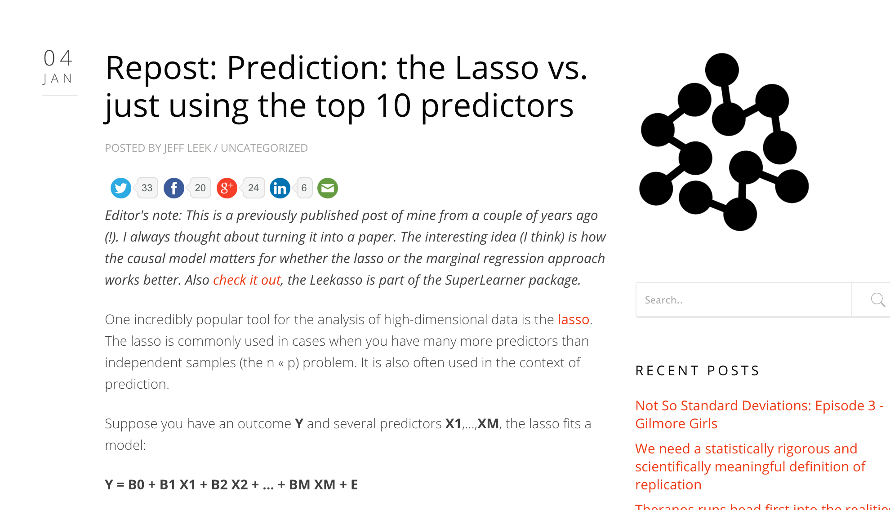
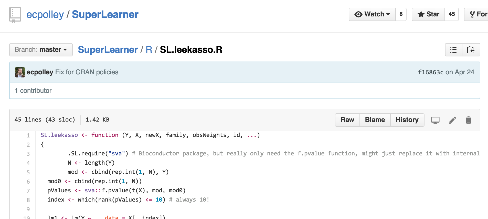
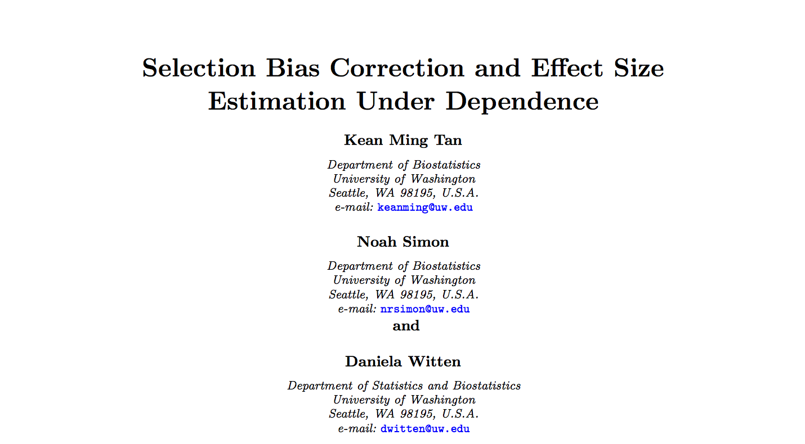
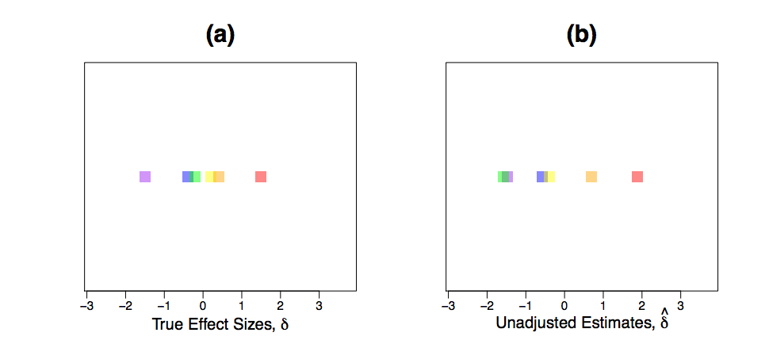
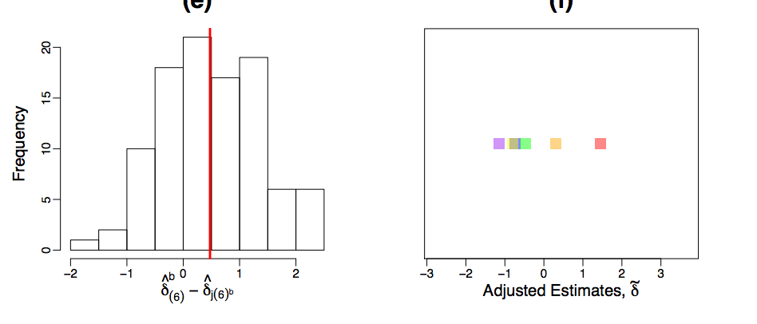

## Today: penalized regression {.smaller}


__You should care because__

* Now a standard tool
* _Tons_ of people work on it
* Interesting/clever theory to be done

http://statweb.stanford.edu/~tibs/lasso/lasso.pdf


## Defining some terms {.smaller}

* _Loss function_: $L \left\{Y,f(X)\right\}$
  * $L \left\{Y,f(X)\right\} = \left\{Y-f(X)\right\}^2$
  * $L\left\{Y,f(X)\right\} = |Y-f(X)|$
  * $L\left\{Y,f(X)\right\} = \left\{\begin{array}{cc} 0 & if \; Y=f(X)\\ 1 & else \end{array}\right.$ (binary data)

* _Expected prediction error (EPE)_: $E_X E_{Y|X}\left[\{Y-f(X)\}^2| X\right]$
  * For squared error loss this is minimized by conditional expectation
  * $f(x) = E[Y | X = x]$
  
* _Regression function_: $f(x)$

* _Training error_: $\frac{1}{N} \sum_{i=1}^N \{y_i - \hat{f}(x_i)\}^2$


## An example {.smaller}

$$Y = \beta_0 + \beta_1 X_1 + \beta_2 X_2 + \epsilon$$

where $X_1$ and $X_2$ are nearly perfectly correlated (co-linear). You can approximate this model by:

$$Y = \beta_0 + (\beta_1 + \beta_2)X_1 + \epsilon$$

The result is:

* You will get a good estimate of $Y$
* The estimate (of $Y$) will be biased 
* We may reduce variance in the estimate


## Prostate cancer 

```{r prostate}
library(ElemStatLearn); data(prostate)
str(prostate)
```


## Subset selection


[Code here](http://www.cbcb.umd.edu/~hcorrada/PracticalML/src/selection.R)


## Most common pattern


http://www.biostat.jhsph.edu/~ririzarr/Teaching/649/


## Model selection approach: split samples {.smaller}

* No method better when data/computation time permits it

* Approach
  1. Divide data into training/test/validation
  2. Treat validation as test data, train all competing models on the train data and pick the best one on validation. 
  3. To appropriately assess performance on new data apply to test set
  4. You may re-split and reperform steps 1-3

* Two common problems
  * Limited data
  * Computational complexity
  


## Decomposing expected prediction error {.smaller}

Assume $Y_i = f(X_i) + \epsilon_i$

$EPE(\lambda) = E\left[\{Y - \hat{f}_{\lambda}(X)\}^2\right]$

Suppose $\hat{f}_{\lambda}$ is the estimate from the training data and look at a new data point $X = x^*$

$$E\left[\{Y - \hat{f}_{\lambda}(x^*)\}^2\right] = \sigma^2 + \{E[\hat{f}_{\lambda}(x^*)] - f(x^*)\}^2 + var[\hat{f}_\lambda(x_0)]$$

<center> = Irreducible error + Bias$^2$ + Variance </center>


## Bias-variance tradeoff

* This decomposition is known as a bias-variance tradeoff
* As the model becomes more complex (more terms) you reduce bias by getting local structure/curvature
* But coefficient estimates suffer from high variance for more terms/colinear terms
* So introducing a little bias in our estimate for $\beta$ might lead to substantial decrease in MSE


## Hard thresholding

* Model $Y = f(X) + \epsilon$

* Set $\hat{f}_{\lambda}(x) = x'\beta$

* Constrain only $\lambda$ coefficients to be nonzero. 

* Selection problem is after chosing $\lambda$ figure out which $p - \lambda$ coefficients to make nonzero


## Shrinkage and penalties {.smaller}

* Suppose $Y_i \sim N(\theta, \sigma^2 I)$ where we estimate $\hat{\theta}$ on the basis of the $Y$ variables and $\sigma^2$ is known - we would usually choose $\hat{\theta} = \bar{Y}$. 

* Stein showed that if the goal is to minimize the mean squared error $E[(\theta - \hat{\theta})^2]$ and we have $n \geq 3$ observations, we can always do better than the mean with estimators like this:
$$\hat{\theta}_{JS} = \left(1-\frac{(m-2)\sigma^2}{||\bar{Y}||^2}\right)\bar{Y}$$ 

* Even more surprising, if we consider any direction $\nu$ 
$$\hat{\theta}_{JS}=\left(1-\frac{(m-2)\sigma^2}{||\bar{Y} - \nu||^2}\right)(\bar{Y} - \nu) + \nu$$
also has lower MSE than the mean!!


## Shrinkage and penalties {.smaller}

Shrinkage can be thought of as "constrained" minimization.\vsp
Minimize:

$\sum_{i=1}^n (Y_i - \mu)^2$ subject to $\mu^2 \leq c$


Differentiating: 

$$-2 \sum_{i=1}^n (Y_i - \hat{\mu}_c) + 2\lambda_c \hat{\mu}_c = 0$$

So 

$\hat{\mu}_c = \frac{\sum_{i=1}^nY_i}{n + \lambda_c} = K_c\bar{Y}$ where $K_c < 1$


The precise form of $\lambda_c$ is unimportant: as $c \rightarrow 0$, $\hat{\mu} \rightarrow \bar{Y}$, as $c \rightarrow \infty$, $\hat{\mu}_c \rightarrow 0$. 


## Shrinkage and penalties {.smaller}

* Giving up bias to reduce variance
* Not all biased models are better - we need to find ``good'' biased models
* Generalized one-sample problem: penalize large values of $\beta$ this should lead to ``multivariate'' shrinkage
* Heuristically, many $\beta > 0$ is interpreted as complex model.
* For good penalties there is often an equivalent Bayesian interpretation
* If the truth is really complex, this may not work! (But it will then be hard to build a good model anyway...)


## Another issue for high-dimensional data 

```{r ,dependson="prostate"}
small = prostate[1:5,]
lm(lpsa ~ .,data =small)
```


## Regularization for regression {.smaller}

If the $\beta_j$'s are unconstrained:
    * They can explode
    * And hence are susceptible to very high variance

To control variance, we might regularize/shrink the coefficients. 

$$ PRSS(\beta) = \sum_{j=1}^n (Y_j - \sum_{i=1}^m \beta_{1i} X_{ij})^2 + P(\lambda; \beta)$$

where $PRSS$ is a penalized form of the sum of squares. Things that are commonly looked for

* Penalty reduces complexity
* Penalty reduces variance
* Penalty respects structure of the problem


## Ridge regression {.smaller}

Solve:

$$ \sum_{i=1}^N \left(y_i - \beta_0 + \sum_{j=1}^p x_{ij}\beta_j \right)^2 + \lambda \sum_{j=1}^p \beta_j^2$$

equivalent to solving

$\sum_{i=1}^N \left(y_i - \beta_0 + \sum_{j=1}^p x_{ij}\beta_j \right)^2$ subject to $\sum_{j=1}^p \beta_j^2 \leq s$ where $s$ is inversely proportional to $\lambda$ 

Solution is:

$$\hat{\beta}^{ridge} = (X^TX + \lambda I)^{-1} X^T y$$

Inclusion of $\lambda$ makes the problem non-singular even if $X^TX$ is not invertible. (this was the original motivation for ridge regression - see Hoerl and Kennard 1970)


## Ridge coefficient paths


## Tuning parameter $\lambda$

* $\lambda$ controls the size of the coefficients
* $\lambda$ controls the amount of {\bf regularization}
* As $\lambda \rightarrow 0$ we obtain the least square solution
* As $\lambda \rightarrow \infty$ we have $\hat{\beta}_{\lambda=\infty}^{ridge} = 0$


## Lasso {.smaller}

$\sum_{i=1}^N \left(y_i - \beta_0 + \sum_{j=1}^p x_{ij}\beta_j \right)^2$ subject to $\sum_{j=1}^p |\beta_j| \leq s$ 

also has a lagrangian form 

$$ \sum_{i=1}^N \left(y_i - \beta_0 + \sum_{j=1}^p x_{ij}\beta_j \right)^2 + \lambda \sum_{j=1}^p |\beta_j|$$

For orthonormal design matrices (not the norm!) this has a closed form solution

$$\hat{\beta}_j = sign(\hat{\beta}_j^0)(|\hat{\beta}_j^0 - \gamma)^{+}$$
 
but not in general. 


## Computing lasso solutions -least angle regression


http://www.stanford.edu/~hastie/Papers/LARS/LeastAngle_2002.pdf

[lars package](http://cran.r-project.org/web/packages/lars/index.html)


## Why does the lasso produce zeros?


[Image via Han Liu](http://www.princeton.edu/~hanliu/)


## Forward stagewise

* Start with residual $R = Y$ and $\beta_j = 0 \forall j$
* Find the predictor $X_j$ most correlated with $R$
* Update $\beta_j = \beta_j + \delta$ where $\delta_j = e \times sign(X^T_j R)$
* Set $R \leftarrow R - \delta_j X_j$


## Paths of lasso/lars/stagewise in R
```{r eval =FALSE}
library(lars); data(diabetes); library(MASS); dim(lars1$x)
length(diabetes$y)
mod1 = lars(diabetes$x,diabetes$y,"lasso")
mod2 = lars(diabetes$x,diabetes$y,"forward.stagewise")
mod3 = lm.ridge(diabetes$y ~ diabetes$x,lambda=seq(0,2e4,by=20))
par(mfrow=c(1,3))
matplot(cbind(apply(abs(mod1$beta),1,sum)),mod1$beta,col="blue",type="l",
        lwd=3,xlab="Sum of absolute betas", ylab="beta hat")
matplot(cbind(apply(abs(mod2$beta),1,sum)),mod2$beta,col="red",type="l",
        lwd=3,xlab="Sum of absolute betas", ylab="beta hat")
matplot(cbind(apply(abs(mod3$coef),2,sum)),t(mod3$coef),type="l",col="purple",
        lwd=3,xlab="Sum of absolute betas", ylab="beta hat")

```


## Coefficient path comparison


## I prefer simpler in many cases {.smaller}





## Example {.smaller}

* I simulated 500 variables and 100 samples for each study, each N(0,1)
* I created an outcome that was 0 for the first 50 samples, 1 for the last 50 
* I set a certain number of variables (between 5 and 50) to be associated with the outcome using the model $X_i = b_{0i} + b_{1i}Y + e$ 
* I tried different levels of signal to the truly predictive features
* I generated two data sets (training and test) from the exact same model for each scenario
* I fit the Lasso using the lars package, choosing the shrinkage parameter as the value that minimized the cross-validation MSE in the training set
* I fit the top 10 (Leekasso) and the Lasso on the training sets and evaluated accuracy on the test sets.

## Results {.smaller}

Difference in accuracy - features increasing from bottom to top, signal from left to right


http://simplystatistics.org/2014/01/04/repost-prediction-the-lasso-vs-just-using-the-top-10-predictors/
http://simplystatistics.org/2014/03/12/oh-no-the-leekasso/


## Interesting fallout


http://simplystatistics.org/2014/03/12/oh-no-the-leekasso/

## Interesting fallout



https://github.com/ecpolley/SuperLearner/blob/master/R/SL.leekasso.R

## *IC

$$AIC (p) = −2 N loglik + 2p/N$$

$$BIC(p) = −2loglik+ p log n$$

$$DIC(p) = -2loglik(\bar{\theta}) + \frac{1}{2} Var\left(D(\theta)\right)$$

Many more $BPIC, FIC,....$ etc. etc. etc . 

## Selection problem 



## What this looks like




## Bootstrap solution





## Take homes

* Regularization is a good idea
* But it isn't "the" idea
* Careful with interpreting after selection
* Careful with estimating after selection


## Lecture slides credits

* [Hector Corrada Bravo's Practical Machine Learning lecture notes](http://www.cbcb.umd.edu/~hcorrada/PracticalML/)
* [Hector's penalized regression reading list](http://www.cbcb.umd.edu/~hcorrada/AMSC689.html#readings)
* [Elements of Statistical Learning](http://statweb.stanford.edu/~tibs/ElemStatLearn/)

