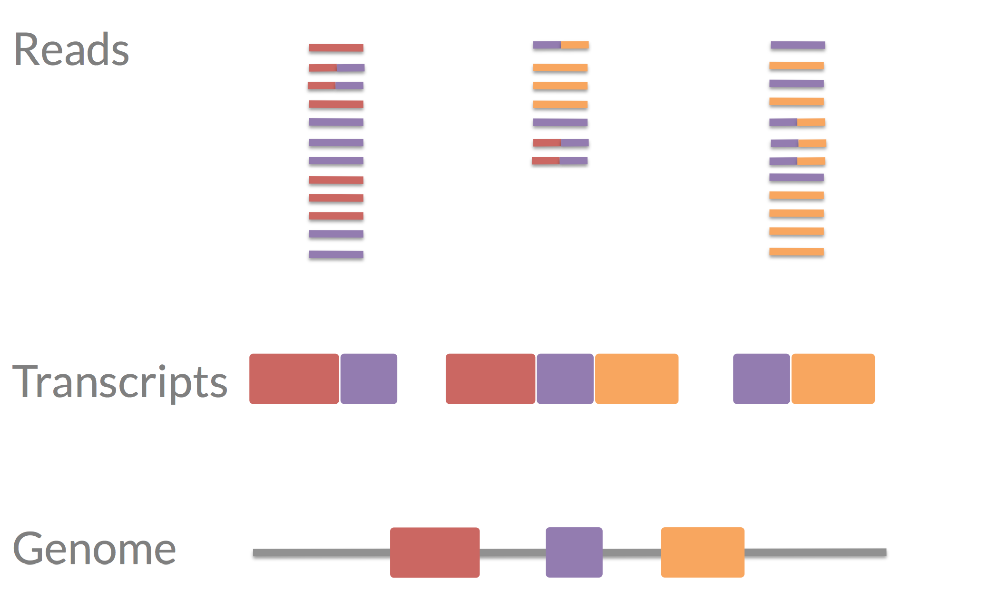
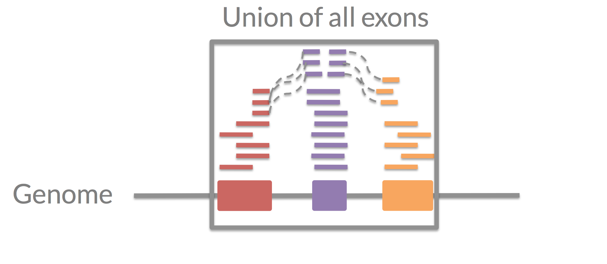
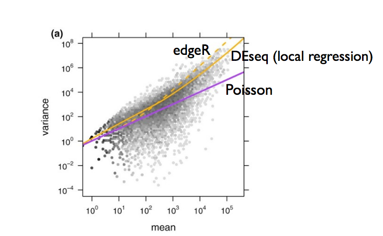
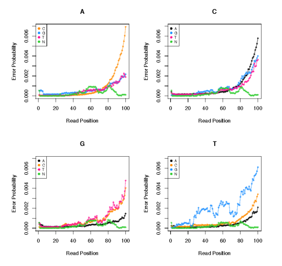
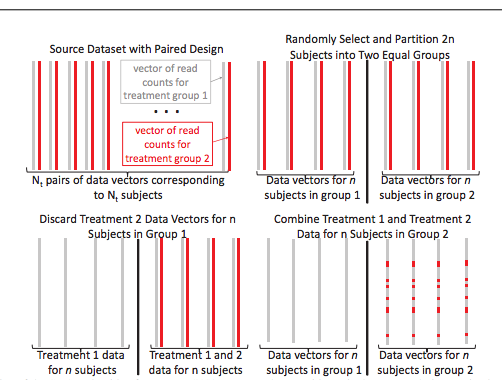
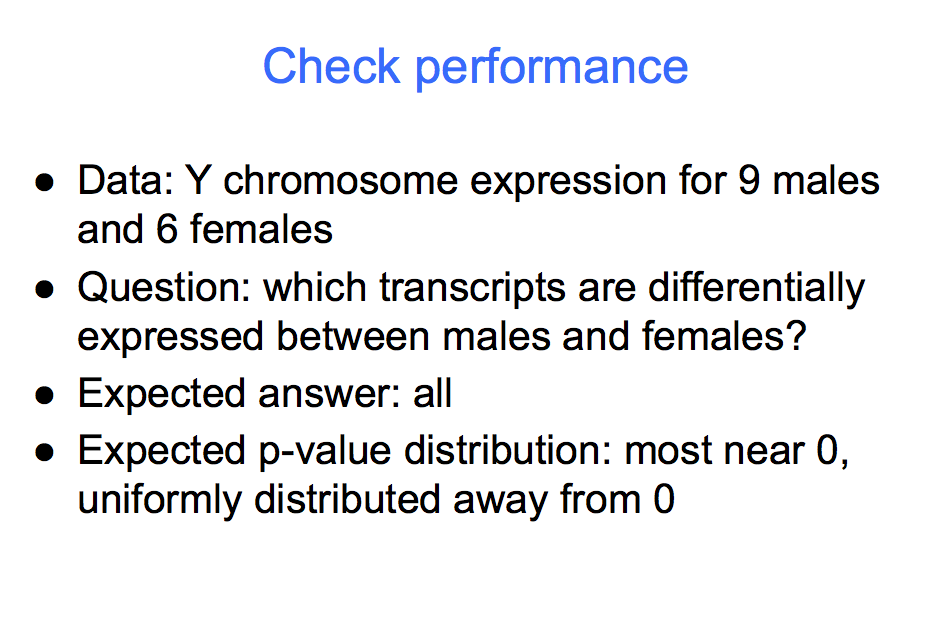
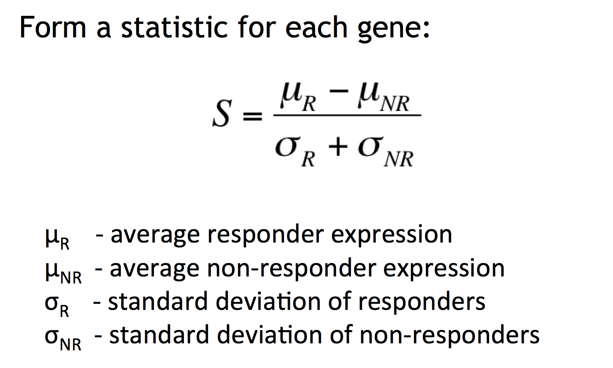
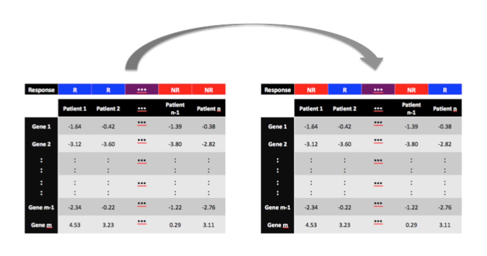
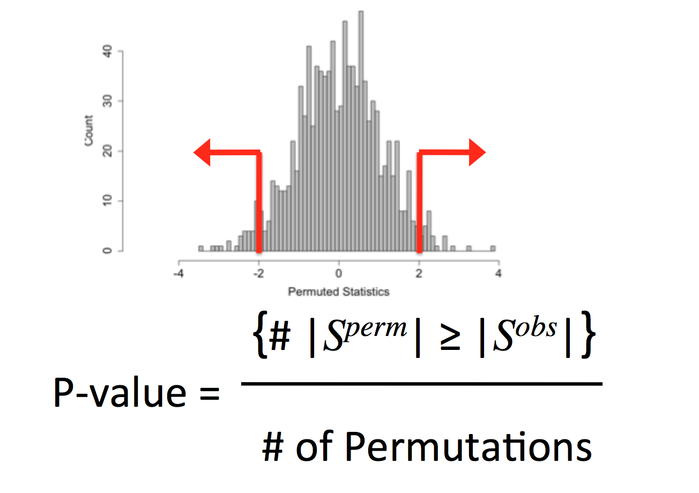

## "Monte Carlo"


## What is simulation good for? 

1. To perform inference
2. To understand methods/algorithms
3. To create data it would be difficult to sample


## An interesting talk


https://speakerdeck.com/jakevdp/statistics-for-hackers

## Key idea: mimic real data generation

* Can be simple
    * `rnorm(100)`
* Can be very complicated


## Important point: setting a seed {.smaller}

No seed 
```{r}
rnorm(5); rnorm(5)
```

Seed

```{r}
set.seed(1); rnorm(5)
set.seed(1); rnorm(5)
```


## Some useful functions

* The "r" functions `rbinom`, `rnorm`, `rpois`...
* `mvrnorm` from the MASS package
* `sample` 
* `sample_n` from the dplyr package
* `sample_frac` from the dplyr package

## Simulation is used for

* Checking methods
* Confirming results
* Negative/positive controls

## Simulate the extremes


http://simplystatistics.org/2013/03/06/the-importance-of-simulating-the-extremes/

## Four approaches to simulating data

* Fully parametric and made up
    * Every stats theory paper ever
* Parametric but modeling real data characteristics
    * Many applied papers
    * Lots of grey area
* Non-parametric - resampling real data
    * Knowing the right signal size is hard 
* Non-parametric - just real data
    * Can be best but hardest to do
    * Hard to know "right answer"


## Example RNA-seq




## Counting RNA-seq




## Approach 1 - fully parametric

* `rnbinom` 



http://www.genomebiology.com/2010/11/10/R106


## Approach 2 - modeling characteristics



http://bioinformatics.oxfordjournals.org/content/early/2015/04/28/bioinformatics.btv272.abstract

## Approach 3 - non-parametric resampling real data



http://bioinformatics.oxfordjournals.org/content/early/2015/02/26/bioinformatics.btv124

## Approach 4 -  real data



http://biostatistics.oxfordjournals.org/content/early/2014/01/06/biostatistics.kxt053.full


## Simulation for testing

* Simulation is often used for hypothesis testing
* It is also used for calculating confidence intervals
* In some ways it is _much easier_ than working out the math
* But it is super easy to trick yourself
    * Correlation
    * Multiple covariates
    * Strange sampling distribution
    * etc., etc. etc. 
* Key is thinking very carefully about _what_ you are trying to mimic


## Testing - fair warning

* In many scientific applications, producing/interpreting estimates and intervals will be your default. But hypothesis testing (for better or worse) plays a major role in the scientific enterprise.
* There is a huge literature bashing P-values and hypothesis tests. Search "NHST" on Google or read anything by Jim Berger, Andrew Gelman, Steve Goodman, etc. etc. 
* I personally think the problem is that people don't understand (or willfully misinterpret) the P-value.
* Doing tests is simple; based on the available data, we make a binary decision. Frequentist calibration of the testing "rule" considers replications of the experiment.
* Interpretation of testing results is trickier. You may need to
be flexible about how testing is viewedit may change as you
work in different areas of science. 


## P-values

* If properly credited R.A. Fisher would have at least 3 million citations for p-value paper
    * Calculated using Google Scholar using the formula: _Number of P-value Citations = # of papers with exact phrase "P < 0.05" + (# of papers with exact phrase "P < 0.01" and not exact phrase "P < 0.05"") + (# of papers with exact phrase "P < 0.001" and not exact phrase "P < 0.05" or "P < 0.01")= 1,320,000 + 1,030,000 + 662,500_
* This is probably even conservative and is at least 12 times the most cited paper Protein Measurement with the Folin Phenol Reagent
* Related idea: if you do something important expect major criticism/ripoffs.
* Related: [Scalability of statistical procedures](http://simplystatistics.org/2014/02/14/on-the-scalability-of-statistical-procedures-why-the-p-value-bashers-just-dont-get-it/)

## P-values

P-values, although not essential for doing tests, are nearly ubiquitous in applied work. They are a very useful "shorthand" and you should understand them.

Under the convention that larger test statistics occur farther from $H_0$, for observed data $Y$ we  define:
$$p = p(Y) = Pr_{Y'\sim F|H_0}[T(Y') > T(Y)]$$
i.e. the long-run proportion of datasets, under the null, which are "more extreme" than the observed $Y$.

## P-values: fair warning

* If $p < \alpha$, the result is "significant" otherwise it is "not significant" $p$ is the "largest $\alpha$ at which the result would be significant" - i.e. it summarizes the tests you could do. 
* If $p$ is small, you could say the data are "inconsistent" with $H_0$ (not the same as an inconsistent estimator). Avoid writing about "evidence" or "support", unless these terms express what you really mean. Writing that the data "suggest" conclusions is safe(r). 
* Small $p$ occur
  1. when $H_0$ is true and something unusual happened, 
  2. when $H_0$ is not true.  
* On its own, a small $p$ does not distinguish these two things
*  For discrete $Y$, $T(Y) = T(Y')$ can happen, discreteness of $p$ is only interesting in small samples, and is often ignored

## Distribution of P-values

What's the distribution of a $p$-value? Under the null:

$$Pr_{Y \sim F|H_0}[p(Y) < \alpha] = Pr_{Y \sim F|H_0}\left[Pr_{Y' \sim F|H_0}[T(Y') > T(Y)] \leq \alpha \right]$$
$$= Pr{Y \sim F|H_0}[ 1 - \mathcal{F}(T(Y)) \leq \alpha]$$
$$= Pr{Y \sim F|H_0}[T(Y) > \mathcal{F}^{-1}(1-\alpha)]$$
$$= 1 - \mathcal{F}(\mathcal{F}^{-1}(1-\alpha)) = \alpha$$

where $\mathcal{F}(\cdot)$ denotes the cumulative distribution function of $T(Y)$ under the null. 

## Important properties of p-values

* $p$-values are uniform on $[0,1]$ under the null 
* $p$-values are given by the "tail area" of the distribution of (replicate) $T(Y')$ beyond observed $T(Y)$ under the null
*  $p$-values are (complicated) functions of the observed data

## What p-values are not

There is a tremendous confusion over $p$-values. The following hold very generally

* They do not represent $Pr(H_0 {\rm is \; true})$ or $Pr(\theta > 0)$. Statements like this don't even make sense in a frequentist setting - so avoid writing them or something that could be interpreted this way. 
*  The are not "measures of evidence". They are a summary of the testing decision you could make, a and a potentially useful function of the data. "Evidence" is a loaded word to some statisticians!
* $p \leq 0.05$ is not "proof" of anything. 
* $p \neq 0$ (Why?) - don't round $p$ values down. You can write, e.g. $p < 10^{-4}$


## Calculating a p-value (permutation)

Suppose we observe survival times on 16 mice in a treatment and a control group: 
$$X = (94, 197, 16, 38, 99, 141, 23)$$ 
$$Y = (52, 104, 146, 10, 51, 30, 40, 27, 46)$$ 
$X \sim F$ and the values $Y \sim G$ and we want to test: $H_0: F = G$. \vsp
The difference of means is $\hat{\theta} = \bar{x} - \bar{y} = 30.63$. One way to calculate a p-value would be to make a parametric assumption. \vsp 

Another clever way, devised by Fisher is __permutation__. Define the vector $g$ to be the group labels $g_i = 1$ if treatment (X) and $g_i = 0$ if control (Y). Then pool all of the observations together into a vector $v = (94, 197, 16, 38, 99, 141, 23, 52, 104, 146, 10, 51, 30, 40, 27, 46)$


## P-value permutations

If there are $n$ samples from $F$ and $m$ samples from $y$ for a total of $N = m + n$ samples, then there are ${N}\choose{n}$ possible ways to assign the group labels. 

Under $F = G$ it is possible to show that - conditional on the observed values - each of these is equally likely. So we can write our statistic $$\hat{\theta} = \bar{x} - \bar{y} = \frac{1}{n} \sum_{g_i = 1} v_i - \frac{1}{m}\sum_{g_i=0} v_i$$

The permutation null distribution of $\hat{\theta}$ is calculated by forming all permutations of $g$ and recalculating the statistic.


## P-value permutations

* Then a permutation p-value is the permutation probability that $|\hat{\theta}^+|$ exceeds $|\hat{\theta}|$. $Pr(\hat{\theta}^+  \geq \hat{\theta})  = \#\{|\hat{\theta}^+| \geq |\hat{\theta}| \} / {{N}\choose{n}}$. \vsp
* This is an _exact_ calculation, just like we did before with the exact plug-in estimator. But usually ${N}\choose{n}$ is humongous, so we use Monte Carlo.
* Sample the labels $g_i$ _with replacement_ to get $B$ permuted sets of group labels $g_i^{'b}$
* Calculate the permutation p-value:
$$\hat{p}_{perm} =  \#\{|\hat{\theta}^{b}| \geq |\hat{\theta}| \} /B$$


## P-values should never be zero


$$\hat{p}_{perm} =  \left(\#\{|\hat{\theta}^{b}| \geq |\hat{\theta}| \} + 1\right) /(B+1)$$

http://www.statsci.org/webguide/smyth/pubs/permp.pdf


## Form a statistic




## Permute




## Calculate p-value




## Permutation notes

* This simple approach works great for 2 sample problems with no covariates
* This tests whether the whole distributions are the same between classes
* Permutations can be calculated exactly (but never are)
* This is primarily a testing approach - some don't like it
* It is used _all.the.time._
* A permutation test exploits a special symmetry that exists
under the null hypothesis to create a permutation distribution.

## An example

* We could studentize the statistic or not
    * $$\hat{\theta} = \frac{\bar{x} - \bar{y}}{\bar{\sigma} \sqrt{1/n + 1/m}}$$
    * $$\hat{\theta} =  \bar{x} - \bar{y}$$
* In the case of the permutation test we would get the same permutation p-value (why?)


## The bootstrap - the 30,000 foot view

Bootstrapping is a computational procedure for:

* Calculating standard errors
* Forming confidence intervals
* Performing hypothesis tests
* Improving predictors (called bagging)


## A bit of history

The basic idea behind bootstrapping is to treat the sample of data you observe (or some appropriate function of the data) as
if it was the super-population you were sampling from. Then you sample from the observed set of values to try to approximate
the sampling variation in the whole population. 

The idea of the bootstrap was originally proposed by [Efron in 1979](http://projecteuclid.org/DPubS?service=UI&version=1.0&verb=Display&handle=euclid.aos/1176344552) 

Related ideas are very old by the standards of statistics (Quenouille, 1956 Notes on bias in estimation. Tukey, 1958 Bias and confidence in not-quite large samples) 


## The Frequentist "Central Dogma"


 
## The Bootstrap "Central Dogma"


## The plug in principal and ECDF 

The __plug-in__ principle states that if we have a parameter $\theta = t(F)$, then we estimate the parameter
by applying the same functional to an estimate of the distribution function $\hat{\theta} = t(\hat{F}_n)$. Although
other estimates can also be used
The default $\hat{F}_n = {\mathbb F}_n$ is the empirical distribution $$ {\mathbb F}_n(y) = \frac{1}{n} \sum_{i=1}^n 1(Y_i \leq y)$$
A sample $Y_i^+$ from ${\mathbb F}_n$ has the property that $Y_i^+ = Y_j$ with probability $1/n$ for $1 \leq j \leq n$

## Why that choice? 

* Why ${\mathbb F}_n$?
    * Glivenko-Cantelli ($||{\mathbb F}_n-F||_\infty  = \sup_{y\in \mathbb{R}}|{\mathbb F}_n(y) - F(y)| \rightarrow_{a.s.} 0$)
    * ${\mathbb F}_n$ is a maximum likelihood estimate (see e.g. http://www.cs.huji.ac.il/~shashua/papers/class3-ML-MaxEnt.pdf)
    * It is reasonable 
    * Equivalent to replacing integrals withs ums

## An example of the plug in principle

Suppose $Y_i > 0$ are _i.i.d._ from $F$. We might be interested in:
$$ \theta = {\rm E}_F \log(Y)$$
- the log of the geometric mean of F. A plug in estimate of $\theta$ is:
$$\hat{\theta} = {\rm E}_{{\mathbb F}_n} \log(Y^+)$$
which is actually available in closed form:
$$\hat{\theta} = \frac{1}{n} \sum_{i=1}^n \log(Y_i)$$


## Another example

Let $Y$ be a binary variable and suppose
$$\theta(F) = Pr(Y = 1) = {\rm e}_F[1(Y_i = 1)]$$
We can find the estimate of $\theta(F)$ using the plug-in principle:
$$\hat{\theta} = {\rm e}_{{\mathbb F}_n}[1(Y_i^+ = 1)] = \bar{Y}$$
Suppose we wanted an estimate for the variance $${\rm Var}(\hat{\theta}) = {\rm Var}(\bar{Y}) = {\rm Var}(Y_i)/n$$

We could use the plug in estimator
$${\rm Var}_{{\mathbb F}_n}(Y_i)/n = {\rm e}_{{\mathbb F}_n}[(Y_i^+ - \bar{Y})^2]/n = \frac{Ar{Y}(1-\bar{Y})}{n}$$


When evaluating ${\rm E}_{{\mathbb F}_n}$, $\bar{Y}$ is a ``parameter'' and treated as fixed. 


## Bootstrap - usually no closed form

Usually, no closed form evaluation will exist (we sort of "got lucky" in the previous examples). How did we get lucky? The plug-in estimate ended up being an expectation of a single random variable $Y_i^+$.

* What if we were unlucky and the plug in estimate was a function of all of the values $Y_1^{+},\ldots,Y_n^{+}$?

* For example, suppose we wanted to estimate the variance of the sample median $\hat{\theta} = {\mathbb F}_n^{-1}(1/2)$?

* In this case, the variance ${\rm Var}_{{\mathbb F}_n}(\hat{\theta})$ is an expectation of a function of $Y_1^+,\ldots,Y_n^+$.


## Too many bootstrap samples

It isn't clear there is a pretty formula for the variance of the median, but if we let $X_j$ denote the number of times $Y_j$ occurs in a bootstrap sample, then: $(X_1,\ldots,X_n) \sim Mult(n; 1/n,\ldots, 1/n)$ so:
$$ \sum_{Y^\in \mathcal{S}} \left\{{\mathbb F}_n^{+-1}(1/2) - {\rm E}_{{\mathbb F}_n}[{\mathbb F}_n^{-1}(1/2)]\right\}^2 \frac{n!}{\prod_{i=1}^n x_i!} (1/n)^n$$
where ${\mathbb F}_n^{+-1}(1/2)$ is the sample median for each bootstrap sample and $\mathcal{S}$ is the set of all unique
bootstrap samples from $Y_1,\ldots,Y_n$. 

* There are ${2n -1}\choose{n}$ unique bootstrap samples.
* For $n = 10$ there are 92,378 unique values. For $n=25$ there are 63.2 trillion or so. 


## Monte carlo bootstrap

Most of the time, you'll use the bootstrap for parameters where a closed form doesn't necessarily exist. 
Instead we use a __Monte Carlo__ approach. 
For the variance of the sample median you would:

* Select $B$ independent bootstrap samples $Y^{b}$ from ${\mathbb F}_n$. 
* Recalculate the statistic for each sample $\hat{\theta}^{b} = {\mathbb F}_n^{b-1}(1/2)$
* Approximate $\sum_{Y^\in \mathcal{S}} \left\{{\mathbb F}_n^{-1}(1/2) - {\rm E}_{{\mathbb F}_n}[{\mathbb F}_n^{-1}(1/2)]\right\}^2 \frac{n!}{\prod_{i=1}^n x_i!} (1/n)^n$
by $$\frac{1}{B} \sum_{b=1}^B \left\{{\mathbb F}_n^{'b-1}(1/2) - \bar{{\mathbb F}}_n^{'-1}(1/2)\right\}^2$$ where $\bar{{\mathbb F}}_n^{'-1}(1/2) = \frac{1}{B}\sum_{i=1}^b {\mathbb F}_n^{'b-1}(1/2)$

As $b \rightarrow \infty$ you get closer and closer to the exact or ``ideal bootstrap''. 


## Bootstrap - Monte Carlo standard error

The general form for calculating bootstrap standard errors is similar:

* Select $B$ independent bootstrap samples $Y^{b}$ from ${\mathbb F}_n$. 
* Recalculate the statistic for each sample $\hat{\theta}^{b}$
* Approximate ${\rm E}_{{\mathbb F}_n}[(\hat{\theta} - \hat{\theta})^2]$
by $$\frac{1}{B} \sum_{b=1}^B (\hat{\theta}^{b} - \bar{\hat{\theta}})$$
where $\bar{\hat{\theta}} = \frac{1}{B}\sum_{i=1}^b \hat{\theta}^{b}$
